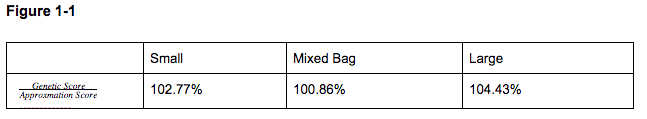
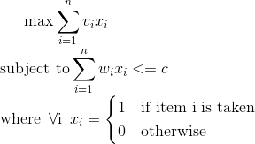

### Project Members
[Aditi Agarwal](aditiagarwal2020@u.northwestern.edu), Ronit Basu, Lukas Gross, Darren Hwang

EECS 349 Northwestern University
### Abstract
Our task is to generate approximation solutions to instances of the 0-1 knapsack problem based on improving generations in a genetic algorithm. The task is important because the 0-1 knapsack problem lies in the set of problems with no known polynomial time solution. If a genetic algorithm solution can match or exceed current approximation algorithms, current applications of the knapsack problem (efficient resource allocation) could be better solved using our algorithm. 

Genetic algorithms are an obvious fit for such a problem due to the 0-1 knapsack problem being a paradigm of combinatorial optimization problem. To achieve the best results we tailored each part of the algorithm to meet our specific needs after iteratively testing each alternative (Elaborated on in the pdf). We use the 2-Approximation Algorithm as the approximation algorithm to compare.

To extract relevant insights from our results we narrowed down the domain of our problem. We begin by defining a scope for the problem we are solving by diving knapsack problems into 3 categories: small items relative to weight (Small), large items relative to weight (Large), small and large items relative to weight (Mixed Bag). 

### Results


In all three cases our algorithm beat popular greedy approximation algorithms as long as the number of generations was in the vicinity of  where n is the number of items in the knapsack. In the interest of time we used /2 generations to approximate the results of the algorithm. The best result was achieved for Large problems where our genetic algorithm achieved a score 4.4% higher on average than the approximation algorithm.



```markdown
Syntax highlighted code block

# Header 1
## Header 2
### Header 3

- Bulleted
- List

1. Numbered
2. List

**Bold** and _Italic_ and `Code` text

[Link](url) and 
```

For more details see [GitHub Flavored Markdown](https://guides.github.com/features/mastering-markdown/).

### Jekyll Themes

Your Pages site will use the layout and styles from the Jekyll theme you have selected in your [repository settings](https://github.com/darrenhwang1/EECS_349_Website/settings). The name of this theme is saved in the Jekyll `_config.yml` configuration file.

### Support or Contact
?
Having trouble with Pages? Check out our [documentation](https://help.github.com/categories/github-pages-basics/) or [contact support](https://github.com/contact) and we’ll help you sort it out.

