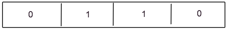

### Project Members
[Aditi Agarwal](aditiagarwal2020@u.northwestern.edu), Ronit Basu, Lukas Gross, Darren Hwang

EECS 349 Northwestern University
### Abstract
Our task is to generate approximation solutions to instances of the 0-1 knapsack problem based on improving generations in a genetic algorithm. The task is important because the 0-1 knapsack problem lies in the set of problems with no known polynomial time solution. If a genetic algorithm solution can match or exceed current approximation algorithms, current applications of the knapsack problem (efficient resource allocation) could be better solved using our algorithm. 

Genetic algorithms are an obvious fit for such a problem due to the 0-1 knapsack problem being a paradigm of combinatorial optimization problem. To achieve the best results we tailored each part of the algorithm to meet our specific needs after iteratively testing each alternative (Elaborated on in the pdf). We use the 2-Approximation Algorithm as the approximation algorithm to compare.

To extract relevant insights from our results we narrowed down the domain of our problem. We begin by defining a scope for the problem we are solving by diving knapsack problems into 3 categories: small items relative to weight (Small), large items relative to weight (Large), small and large items relative to weight (Mixed Bag). 

### Results

In all three cases our algorithm beat popular greedy approximation algorithms as long as the number of generations was in the vicinity of  where n is the number of items in the knapsack. In the interest of time we used /2 generations to approximate the results of the algorithm. The best result was achieved for Large problems where our genetic algorithm achieved a score 4.4% higher on average than the approximation algorithm.

## Detailed Report

### Introduction
We seek to use genetic algorithms to generate approximate solutions to knapsack 0-1 which can beat current approximation algorithms. Today, genetic algorithms are used to generate optimal solutions. The genetic algorithm first chooses parents at random. The parents are then used to produce children for successive generations. At each generation, an optimized solution is created from the given population.

### Definition of the problem

### Knapsack Representation
We represent a solution to a knapsack problem using weight arrays, value arrays, and a corresponding bit array.

Suppose we have a knapsack with capacity 15, and 4 items: (15, 4), (2, 10), (8, 7), (9, 2) where the first number of any pair is the value of the item and the second number is the weight. 

#### Value Array

#### Weight Array

#### Bit Array

This Bit array represents a knapsack solution that takes two items - the first item with value of 10 and weight of 2, and the second item with value of 7 and weight of 8.

### Dataset Generation
We focus primarily on three types of knapsack problems which we denote as the Small, Mixed Bag, and Large problem over 10 items and 50 items.

Small problem:
We define Small problems as knapsack problems where the capacity is much larger the the weights of the items which can be placed into the knapsack. For 50 items, we generate 1000 random instances of knapsack problems with capacity 200 where item has a random weight between 1 and 20 and a random value between 1 and 20. For 10 items, we generate 1000 random instances of knapsack problems with capacity 100 where item has a random weight between 1 and 20 and a random value between 1 and 20.

Mixed Bag problem:
We define Mixed Bag problems as knapsack problems where there exist items which have weights which are much smaller than the capacity and items whose weights are comparable to the capacity. For 50 items, we generate 1000 random instances of these problems with capacity 40 where each item has a random weight between 1 and 20 and a random value between 1 and 20. For 10 items, we generate 1000 random instances of these problems with capacity 40 where each item has a random weight between 1 and 20 and a random value between 1 and 20.

Large problem:
We define Large problems as knapsack problems where there exist only items whose weights are comparable to the capacity. For 50 items, we generate 1000 random instances of these problems with capacity 40 and 50 items where each item had a random weight between 10 and 20 and a random value between 1 and 20. For 10 items, we generate 1000 random instances of these problems with capacity 40 and 50 items where each item had a random weight between 10 and 20 and a random value between 1 and 20.

### First Generation
The first generation consists of 100 solutions. Each solution is a randomly generated solution to the given knapsack problem where items are randomly chosen to be in our knapsack until we exceed capacity.

### Fitness Functions
In our model, we use total value of the solution as the fitness metric. If the total weight of the solution is less than capacity, we simply return the sum of the values of the bag. If the weight exceeds capacity, we penalize the fitness of the solution exponentially relative to the percentage by which it exceeded the capacity. 

We decided on an exponential fitness function after trial and error. We initially set the fitness of solutions exceeding the capacity to 0. However, this meant that these solutions would never breed again which resulted in loss of progress and poor results relative to the greedy approximation algorithm. We then looked at ways to save the progress of the solution while still punishing solutions that were over capacity. After iteratively testing approaches such as applying a log to the fitness value, linear fitness functions and windowing and measuring the accuracy, we eventually settled on an exponential fitness function.

### Breeding Selection

We began with a simple roulette wheel selection method where each parent is assigned probability equal to their fitness function divided by the total sum of each parent’s fitness functions. Then 2N parents are chosen and bred in pairs. However, we began to run into issues where our genetic algorithm would actually return 0 as many children of parents exceeded capacity. In order to combat this, we employed elitism. Elitism is the process by which the top parents are automatically passed onto the next round. Through testing on both small, mixed bag, and large problems, an elitism percentage of 20% resulted in the best accuracy relative to the approximation algorithm. Percentages below 20% significantly reduced performance of the genetic algorithm and percentages above 20% plateaued to results similar to 20%. Finally, we attempted tournament selection. Tournament selection did not improve the performance of genetic algorithms with or without elitism. 
### Number of Generations

In order to determine a good stopping point for our algorithm we ran a thousand different example problems of various sizes, one generation at a time. For each generation we compared its accuracy against the exact answer produced by our dynamic programming solution and we graphed accuracy over time (as shown above for a knapsack of 100 items). We found that the genetic algorithm preformed well when the number of generations was on the order of N^2, where N is the number of items.

### Crossover
In order to guarantee a minimum amount of crossover, we first restricted the pivot point to be in the middle third of the bit string. However, this optimization lead to the adverse effect of items in the first and third sections sticking together, without a good algorithmic reason for them to do so. To fix this issue, we opted to discard our optimization and instead picked a purely random pivot point, which lead to an overall 2% increase in preformance measured relative to our approximation algorithm benchmark. We later considered using two and three crossover points, neither of which saw any improvement.

### Mutation
Our bitstring representation made mutation convenient. Our mutation algorithm took in a bitstring and a mutation probability. The algorithm returned a mutated bitstring. While fine tuning our parameters, we found that a mutation rate of 1/N works best with most instances of our knapsack problem as on average, one item per bitstring would be mutated. Using a fixed mutation rate lowered performance as knapsack solutions with a small amount of items were mutating too often and knapsack solutions with a large amount of items were not mutating enough.

### Complexity Analysis
We will perform brief complexity analysis to prove that our genetic algorithm is polynomial in time. Let us denote the number of items as . Note that for our purposes, the number of solutions per generation is a fixed constant c = 100. Based on the results from fine tuning the number of generations, we will assume O() generations.

For each generation, We must perform mutation over the current generations, resulting in an O(c) operation. We must then compute the next generation of children through breeding of current parents. To do so, we must first compute the fitness of each parent in our generation and then choose at most 2 parents based on roulette selection resulting in another O() operation.

Then, for each generation, in order to compute elitism, we sort the parents by their fitness values, and take the top percentage specified by the argument resulting in an O() operation. 

Finally, we breed the chosen children in pairs of two. This requires iterating through 2 chosen children, an O() operation. Breeding two children is an O(1) operation such that breeding is O().

Therefore total complexity is O()

### Conclusion
In our experiments we have successfully shown that genetic algorithms can be used to get a very good approximation for knapsack problems in polynomial time. The algorithm works best for cases with small solution spaces relative to the number of generations, such as for knapsacks with large items relative to capacity. The main drawback of our algorithm is its O(n^3logn) time complexity which is much larger the O(n) time complexity of greedy approximations. In the future we hope to further study the applications of the knapsack problem and examine whether this accuracy vs time trade off can be applied in real life situations. We look to use our findings to fine tune parameters such as number of generations in our algorithm to meet the needs of real life problems. Additionally, we hope to apply our approach to other combinatorial optimization problems such as set covering for which there aren't simple linear-time approximation algorithms.

### Contributions
Aditi Agarwal - 
Ronit Basu - 
Lukas Gross - Knapsack problem generation, data analysis, and writeup
Darren Hwang - 
